# Hệ Thống Bán Sách E-Commerce

## Giới Thiệu Dự Án

Dự án của nhóm là một hệ thống bán sách trực tuyến được phát triển cho một doanh nghiệp cá nhân. Hệ thống cung cấp các chức năng quản lý sản phẩm, đơn hàng và hỗ trợ khách hàng thông qua công nghệ AI.

## Công Nghệ Sử Dụng

- **Backend**: Spring Boot (Java)
- **Frontend**: Thymeleaf, HTML, CSS, JavaScript
- **Database**: SQL server
- **Payment Gateway**: VNPay
- **AI Integration**: Chatbox AI hỗ trợ khách hàng

## Cấu Trúc Người Dùng

Hệ thống có 3 loại tài khoản chính với các vai trò khác nhau:

### 1. Admin (Quản Trị Viên)
- **Quản lý sản phẩm**: Thêm, sửa, xóa sản phẩm
- **Quản lý nhân viên**: Quản lý tài khoản và quyền hạn nhân viên
- **Xem thống kê**: Theo dõi doanh thu, đơn hàng, sản phẩm bán chạy

### 2. Staff (Nhân Viên)
- **Tư vấn khách hàng**: Hỗ trợ khách hàng qua hệ thống chat
- **Quản lý trạng thái đơn hàng**: Xác nhận, cập nhật trạng thái đơn hàng (Processing → Confirmed → Shipping → Completed)
- **Quản lý kho**: Theo dõi tồn kho sản phẩm

### 3. Customer (Khách Hàng)
- **Tìm kiếm sản phẩm**: Tìm kiếm sách theo tên, tác giả, nhà xuất bản
- **Xem chi tiết sản phẩm**: Thông tin chi tiết về sách
- **Quản lý giỏ hàng**: Thêm, xóa, cập nhật số lượng sản phẩm
- **Đặt hàng và thanh toán**: Thanh toán qua VNPay
- **Theo dõi đơn hàng**: Xem lịch sử và trạng thái đơn hàng
- **Hỗ trợ AI**: Tương tác với chatbox AI để nhận tư vấn sản phẩm

---

## Assignment 1: Demo 3 Workflow Chính

### Workflow 1: Thêm Sản Phẩm Vào Giỏ Hàng và Thanh Toán

#### Bước 1: Trang chủ sau khi đăng nhập
Sau khi đăng nhập thành công, khách hàng sẽ được chuyển đến trang chủ với danh sách sản phẩm.

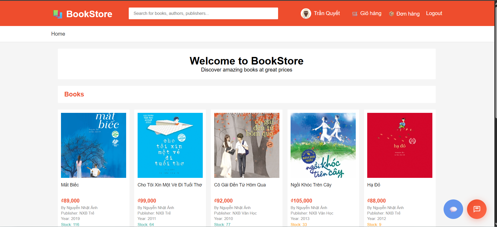

#### Bước 2: Xem chi tiết và thêm sản phẩm vào giỏ hàng
Khách hàng click vào sản phẩm để xem chi tiết, chọn số lượng (ví dụ: 2) và thêm vào giỏ hàng.

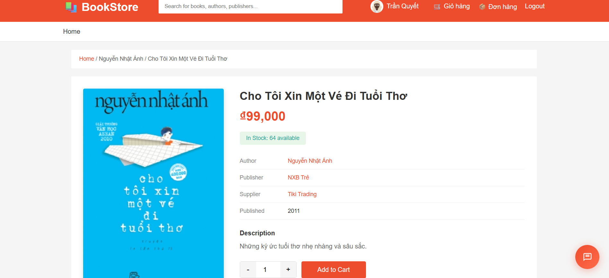

#### Bước 3: Xem giỏ hàng
Khách hàng click vào biểu tượng giỏ hàng để xem các sản phẩm đã thêm.

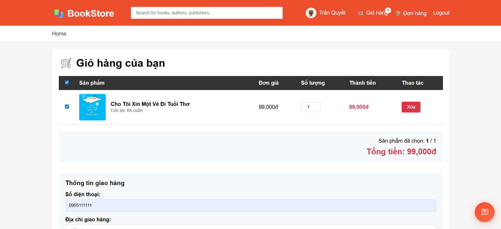

#### Bước 4: Nhập thông tin thanh toán
Khách hàng chọn sản phẩm cần thanh toán và nhập thông tin giao hàng.


#### Bước 5: Chọn phương thức thanh toán
Khách hàng chọn phương thức thanh toán (VNPay).

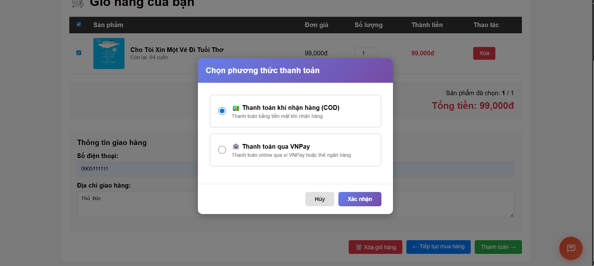

#### Bước 6: Thanh toán qua VNPay Sandbox
Khách hàng thực hiện thanh toán qua VNPay Sandbox với thông tin test.

**Thông tin test VNPay Sandbox:**
- Số thẻ: 9704198526191432198
- Tên chủ thẻ: NGUYEN VAN A
- Ngày phát hành: 07/15
- Mật khẩu OTP: 123456

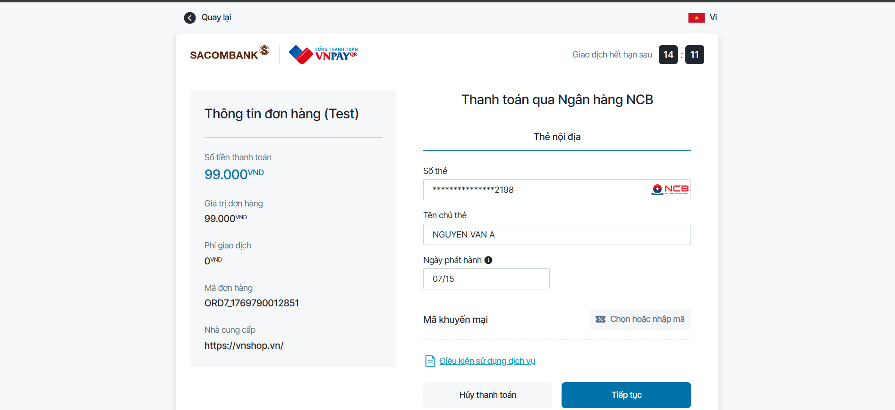

#### Bước 7: Thông báo thanh toán thành công
Hệ thống hiển thị thông báo thanh toán thành công và mã đơn hàng.

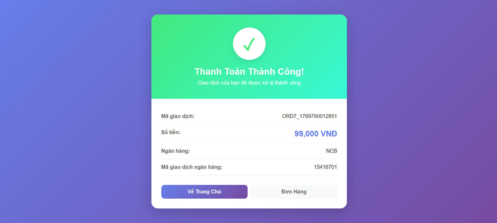

---

### Workflow 2: Quản Lý Trạng Thái Đơn Hàng

#### Bước 1: Khách hàng xem trạng thái đơn hàng
Sau khi thanh toán thành công, đơn hàng sẽ có trạng thái "Đang xử lý" (Processing).

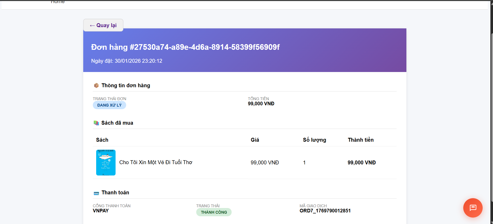

#### Bước 2: Staff xem danh sách đơn hàng chờ xử lý
Nhân viên đăng nhập vào hệ thống và xem danh sách đơn hàng ở trạng thái "Chờ xử lý".

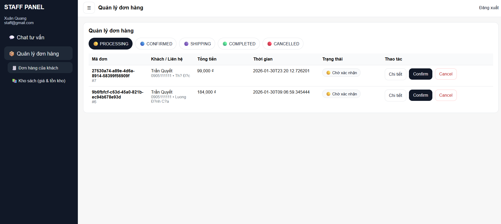

#### Bước 3: Staff xem chi tiết và xác nhận đơn hàng
Nhân viên click vào đơn hàng để xem chi tiết và nhấn nút "Confirm" để xác nhận đơn hàng.

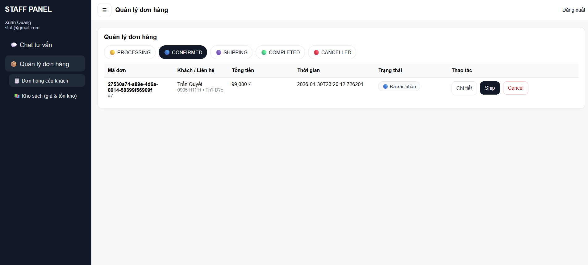

#### Bước 4: Cập nhật trạng thái bên phía khách hàng
Sau khi staff xác nhận, trạng thái đơn hàng bên phía khách hàng được cập nhật sang "Đã xác nhận" (Confirmed).

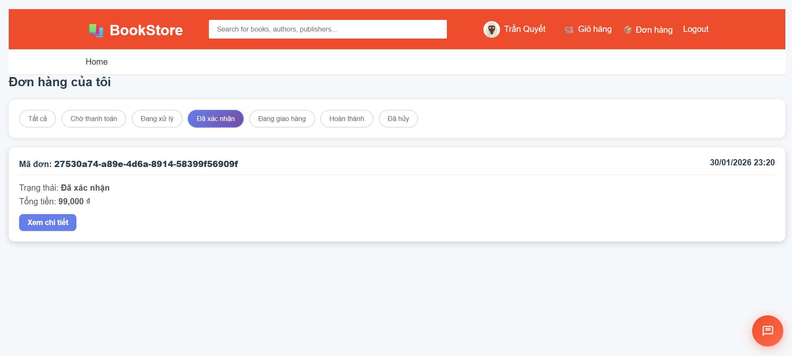

#### Bước 5: Staff cập nhật trạng thái tiếp theo
Staff tiếp tục cập nhật trạng thái đơn hàng qua các bước:
- **Shipping**: Đơn hàng đang được giao
- **Completed**: Đơn hàng đã giao thành công

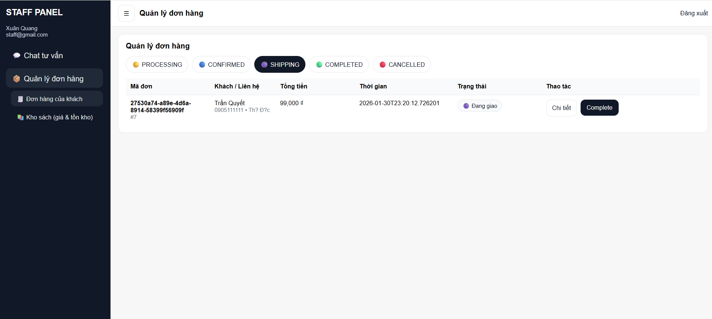

---

### Workflow 3: Chatbox AI Hỗ Trợ Khách Hàng

#### Bước 1: Mở Chatbox AI
Khách hàng click vào biểu tượng chat để mở chatbox AI.

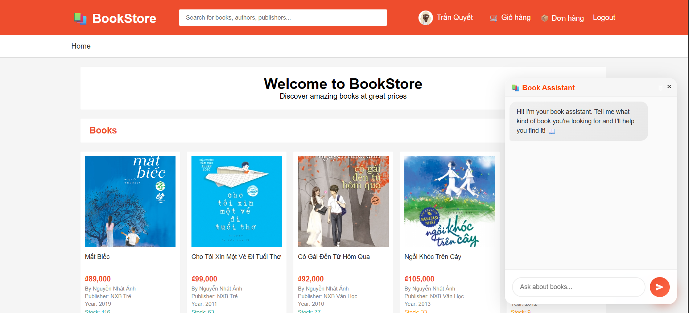

#### Bước 2: Tương tác với AI
Khách hàng đặt câu hỏi về sản phẩm và chatbox AI sẽ đề xuất các sản phẩm phù hợp dựa trên nhu cầu.

**Ví dụ câu hỏi:**
- "Tôi muốn tìm sách về tác giả Nguyễn Nhật Ánh"
- "Sách có giá tiền dưới 100 nghàn"
- "Có sách nào về thể loại truyền thuyết không?"

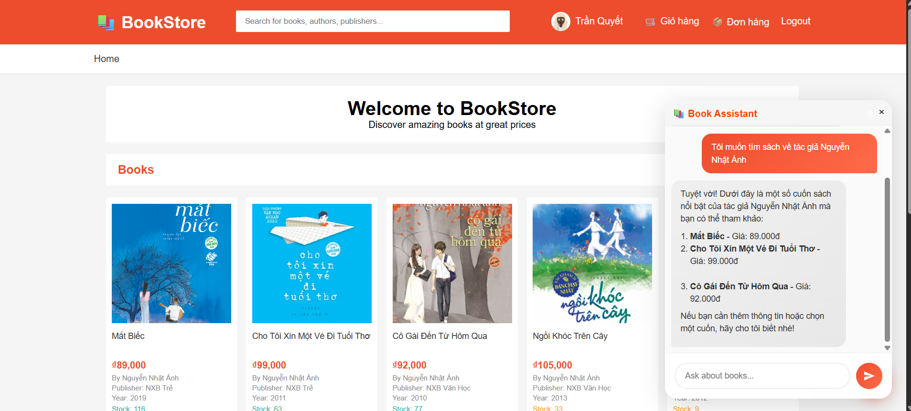

---

## Hướng Dẫn Cài Đặt

### Yêu Cầu Hệ Thống
- Java 17
- Maven 3.6+
- SqlServer

### Các Bước Cài Đặt

1. **Clone repository**
```bash
git clone https://github.com/TrucFPTU/e-commerce.git
cd e-commerce
```

2. **Cấu hình database**
- Tạo database mới (e_commerce)
- Cập nhật thông tin kết nối trong `src/main/resources/application.properties`

3. **Cấu hình VNPay**
- Cập nhật VNPay credentials trong `src/main/resources/application-secrets.properties`

4. **Build project**
```bash
./mvnw clean install
```

5. **Chạy ứng dụng**
```bash
./mvnw spring-boot:run
```

6. **Truy cập ứng dụng**
- Mở trình duyệt và truy cập: `http://localhost:8080`

---

## Tài Khoản Demo

### Admin
- Username: `admin@gmail.com`
- Password: `admin123`

### Staff
- Username: `staff@gmail.com`
- Password: `staff123`

### Customer
- Username: `user2@gmail.com`
- Password: `user123`

*(Lưu ý: Cập nhật thông tin tài khoản demo thực tế của bạn)*

---

## Cấu Trúc Thư Mục

```
src/
├── main/
│   ├── java/com/groupproject/ecommerce/
│   │   ├── controller/     # Controllers xử lý request
│   │   ├── model/          # Entity classes
│   │   ├── repository/     # Data access layer
│   │   ├── service/        # Business logic
│   │   └── config/         # Configuration classes
│   └── resources/
│       ├── templates/      # Thymeleaf templates
│       ├── static/         # CSS, JS, images
│       └── application.properties
└── test/                   # Unit tests
```

---

## Tính Năng Nổi Bật

✅ Quản lý sản phẩm toàn diện  
✅ Hệ thống giỏ hàng thông minh  
✅ Tích hợp thanh toán VNPay  
✅ Chatbox AI hỗ trợ khách hàng 24/7  
✅ Quản lý đơn hàng theo thời gian thực  
✅ Giao diện người dùng thân thiện  
✅ Bảo mật và phân quyền người dùng  

---
